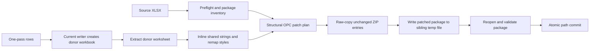

# Existing-Workbook Insert Implementation Plan

[简体中文](insert-existing-workbook-plan.zh-CN.md)

## Status

- Planning baseline: MiniExcel-Rust `e93f851` (`0.2.0`).
- Compatibility reference: MiniExcel .NET `1.46.1`, commit `84be55a97cda12b060107577b8765043eff651b0`.
- Scope: add or replace a worksheet in an existing XLSX workbook while consuming source rows once and preserving unrelated package content.
- Execution rule: implement exactly one numbered task at a time. Do not start the next task until the current task's acceptance tests and narrow validation command pass.
- Public API rule: keep the implementation internal until Task 6. Earlier tasks may expose only crate-private seams used by focused tests.

## Goal

Provide an idiomatic Rust equivalent of MiniExcel v1 `Insert` with stronger package preservation and failure safety:

- Create a workbook when the destination path does not exist.
- Append a new worksheet to an existing workbook.
- Optionally replace an existing worksheet.
- Return the number of data rows written, excluding the header.
- Reuse current `WriteOptions` behavior for headers, formats, styles, panes, filters, widths, visibility, and worksheet validation.
- Support one-pass row producers through an explicit-schema API.
- Preserve unrelated ZIP entries and existing workbook relationship identities.
- Keep the original path valid when generation, validation, or commit fails.

## Reference Contract

The .NET v1 public surface is `MiniExcel.Insert`/`InsertAsync` for paths and streams. The controlling implementation is under `src/MiniExcel/OpenXml/ExcelOpenXmlSheetWriter*.cs`; the primary focused tests are `MiniExcelOpenXmlTests.InsertSheetTest` and its async counterpart.

| Behavior | Target Rust contract |
| --- | --- |
| Missing output path | Create a one-sheet workbook and return the data-row count. |
| New sheet name | Append after existing workbook sheet order. |
| Duplicate name, overwrite disabled | Return a specific error without changing the workbook. |
| Duplicate name, overwrite enabled | Replace the target worksheet while preserving its order, ID, relationship ID, target path, visibility, and active state. |
| Row count | Excludes a printed header. |
| Name matching | Case-insensitive, following Excel worksheet-name semantics. This deliberately fixes v1's case-sensitive lookup. |
| Existing package parts | Preserve byte-for-byte unless they must be structurally patched. |
| Strings in inserted sheet | Convert donor shared strings to inline strings; do not rewrite the existing shared-string table. |
| `.xlsm`, VBA, signatures, encryption | Reject before creating a replacement output. |
| Failure during path insert | Leave the original workbook unchanged. This deliberately improves v1's in-place update behavior. |

## Non-Goals

- Appending rows into an existing worksheet.
- Formula calculation or formula-reference rewriting.
- Editing pivots, charts, tables, comments, images, external links, or VBA content.
- Preserving an overwritten worksheet's dependent objects in the first release.
- Same-stream in-place mutation with crash safety.
- CSV Insert.
- WASM filesystem insertion.
- Async runtime integration in the initial release.

## Proposed Public API

The API should be added only in Task 6, after the package rewrite and atomic path behavior are proven internally.

```rust
#[derive(Clone, Copy, Debug, Default, Eq, PartialEq)]
pub enum ExistingSheetPolicy {
    #[default]
    Error,
    Replace,
}

#[derive(Clone, Copy, Debug, Default, Eq, PartialEq)]
pub enum TargetRelationshipPolicy {
    #[default]
    Reject,
    RemoveSupported,
}

#[derive(Clone, Debug)]
pub struct InsertOptions {
    // Builder-backed fields:
    // write_options: WriteOptions
    // existing_sheet_policy: ExistingSheetPolicy
    // target_relationship_policy: TargetRelationshipPolicy
}

impl MiniExcel {
    pub fn insert(
        path: impl AsRef<Path>,
        rows: &[DynamicRow],
        options: &InsertOptions,
    ) -> Result<usize>;

    pub fn insert_with_schema<I>(
        path: impl AsRef<Path>,
        schema: &[String],
        rows: I,
        options: &InsertOptions,
    ) -> Result<usize>
    where
        I: IntoIterator<Item = Result<DynamicRow>>;

    pub fn insert_serialized<T>(
        path: impl AsRef<Path>,
        rows: &[T],
        options: &InsertOptions,
    ) -> Result<usize>
    where
        T: Serialize;

    pub fn insert_from_reader_to_writer<R, W, I>(
        source: &mut R,
        destination: &mut W,
        schema: &[String],
        rows: I,
        options: &InsertOptions,
    ) -> Result<usize>
    where
        R: Read + Seek,
        W: Write + Seek,
        I: IntoIterator<Item = Result<DynamicRow>>;
}
```

`InsertOptions` should delegate sheet name, header, style, formats, panes, filter, width, and visibility to `WriteOptions`. `overwrite_file` does not apply; replacement is controlled by `ExistingSheetPolicy`.

## Architecture



The donor-workbook approach reuses the tested `XlsxWriter` behavior instead of duplicating serialization, styles, AutoFilter, panes, widths, visibility, and Serde handling. Only the donor worksheet and required style definitions are transplanted.

## Task Sequence

### Task 0: Characterize MiniExcel v1 Insert

- [x] Port the observable cases from the v1 sync and async `InsertSheetTest` into `miniexcel/tests/insert.rs` as an executable contract table. This replaces ignored placeholders with reusable assertions that later tasks can drive.
- [x] Record missing-path creation, appended sheet order, duplicate rejection, replacement, header/no-header row counts, and long sheet-name validation.
- [x] Add a deterministic generated package fixture with non-sequential `sheetId`, non-sequential relationship IDs, hidden/very-hidden sheets, an active sheet, defined names, formulas, shared strings, custom styles, tables, drawings, comments, and custom XML.
- [x] Add a package inventory helper in tests that records ZIP entry names, CRCs, relationship identities, sheet order, IDs, states, active tab, defined names, and style counts.
- [x] Document v1 quirks that Rust will not copy: in-place mutation, sheet-ID renumbering, random relationship replacement, relationship loss, and case-sensitive sheet lookup.

Completed on 2026-08-24. Focused test: `cargo +1.85.0 test -p miniexcel --test insert characterization --locked`.

Acceptance:

- No public API or production package mutation exists yet.
- Every fixture has explicit expected package invariants.
- Focused command: `cargo +1.85.0 test -p miniexcel --test insert characterization --locked`.

### Task 1: OPC Package Inventory And Preflight

Depends on Task 0.

- [x] Add an internal `insert/package.rs` with typed models for content types, workbook sheets, workbook relationships, workbook views, defined names, and worksheet relationships.
- [x] Normalize relationship targets without assuming `sheetN.xml` or deriving paths from `sheetId`.
- [x] Preserve source workbook sheet document order.
- [x] Allocate collision-free `sheetId`, relationship ID, and worksheet target independently.
- [x] Reject duplicate ZIP entry names, unsafe entry paths, encrypted/non-ZIP data, macro-enabled content types, VBA relationships, and signed OPC packages.
- [x] Match worksheet names case-insensitively and reuse existing Excel name validation.
- [x] Add insert-specific errors: duplicate target sheet, unsupported package feature, unsafe package, no visible sheet after operation, and atomic commit failure.

Completed on 2026-08-24. Focused test: `cargo +1.85.0 test -p miniexcel insert::package::tests --lib --locked`.

Acceptance:

- Inventory round-trips all fixture metadata without writing a package.
- No workbook-sized XML is retained beyond the small control parts.
- Focused command: `cargo +1.85.0 test -p miniexcel insert::package::tests --lib --locked`.

### Task 2: Donor Worksheet Extraction

Depends on Task 1.

- [x] Add an internal donor builder that invokes the current `XlsxWriter` for exactly one sheet.
- [x] Extract the donor worksheet, styles, shared strings, and AutoFilter defined-name metadata.
- [x] Convert donor shared-string cells to inline strings using structured XML parsing.
- [x] Preserve formulas exactly as emitted; do not calculate them.
- [x] Expose an internal result containing worksheet XML, data-row count, donor style model, and optional local defined names.
- [x] Add dynamic, explicit-schema, Serde, header-only, and empty/no-header donor tests.
- [x] Add a one-pass explicit-schema row-spool path for future large producers. The spool must be deleted on success, iterator error, or panic unwinding.

Completed on 2026-08-24. Focused test: `cargo +1.85.0 test -p miniexcel insert::donor::tests --lib --locked`.

Acceptance:

- Donor output has no dependency on donor `sharedStrings.xml`.
- Row count and all current `WriteOptions` behavior match normal `save_as` output.
- Focused command: `cargo +1.85.0 test -p miniexcel insert::donor::tests --lib --locked`.

### Task 3: Append-Only Style Rebase

Depends on Task 2.

- [x] Parse existing and donor `styles.xml` into number formats, fonts, fills, borders, cell-style XFs, and cell XFs.
- [x] Never change existing style indices.
- [x] Deduplicate semantically identical donor components when safe; otherwise append them.
- [x] Allocate custom `numFmtId` values above all existing IDs and rewrite donor references.
- [x] Build a donor-cell-XF to target-cell-XF mapping and rewrite every inserted worksheet `s` attribute.
- [x] Enforce Excel style/count limits before writing output.
- [x] Preserve unknown style extensions and unsupported nodes by copying them through the structured patch.

Completed on 2026-08-24. Focused test: `cargo +1.85.0 test -p miniexcel insert::style::tests --lib --locked`. LibreOffice smoke test: set `MINIEXCEL_TEST_SOFFICE` and run `cargo +1.85.0 test -p miniexcel insert::style::tests::rebased_styles_survive_libreoffice_roundtrip --lib --locked -- --ignored --exact`.

Acceptance:

- Existing cells retain identical style IDs and rendering metadata.
- Inserted date/time/duration/custom number formats survive Rust roundtrip and LibreOffice inspection.
- Focused command: `cargo +1.85.0 test -p miniexcel insert::style::tests --lib --locked`.

### Task 4: Append Package Rewrite

Depends on Tasks 1-3.

- [x] Raw-copy every unchanged ZIP entry with its compression and metadata.
- [x] Structurally append one `<sheet>` to `xl/workbook.xml` without replacing workbook views, properties, defined names, calculation settings, or extension lists.
- [x] Append one worksheet relationship to `xl/_rels/workbook.xml.rels` without changing existing IDs or non-sheet relationships.
- [x] Add the worksheet override to `[Content_Types].xml` only when missing.
- [x] Add or update the local `_xlnm._FilterDatabase` defined name when AutoFilter is enabled.
- [x] Write the rebased worksheet to its collision-free target.
- [x] Keep `sharedStrings.xml`, untouched worksheet relationships, tables, drawings, comments, external links, custom XML, themes, and document properties byte-for-byte unchanged.

Completed on 2026-08-24. Focused test: `cargo +1.85.0 test -p miniexcel insert::rewrite::tests --lib --locked`.

Acceptance:

- New sheet appends in workbook order and does not change the active sheet.
- Package inventory differs only in the expected control parts, style additions, and new worksheet.
- Existing formulas and cached values remain unchanged.
- Focused command: `cargo +1.85.0 test -p miniexcel insert::rewrite::tests --lib --locked`.

### Task 5: Atomic Path Commit

Depends on Task 4.

- [x] Write path inserts to a uniquely named sibling temporary file opened with `create_new`.
- [x] Finish the ZIP central directory, flush, sync the temporary file, and reopen it for structural validation.
- [x] Validate workbook/rels/content-types consistency, unique IDs/targets, worksheet availability, and at least one visible worksheet.
- [x] Commit with a safe cross-platform replacement primitive. Workspace code must remain `unsafe`-free; evaluate the existing `tempfile` API first and add a narrowly scoped dependency only if required.
- [x] Preserve original file permissions where supported.
- [x] Clean temporary package and row-spool files on all error paths.
- [x] Add failure injection at preflight, row generation, ZIP copy, ZIP finish, validation, and commit.

Completed on 2026-08-24. Focused test: `cargo +1.85.0 test -p miniexcel insert::atomic::tests --lib --locked`. Windows replacement uses the safe `atomicwrites` wrapper so staged attributes are preserved; Unix mode-bit coverage runs under `cfg(unix)` in CI.

Acceptance:

- The original workbook hash remains unchanged for every injected pre-commit failure.
- Successful replacement works on Linux and Windows CI.
- Focused command: `cargo +1.85.0 test -p miniexcel insert::atomic::tests --lib --locked`.

### Task 6: Public Append API

Depends on Tasks 0-5.

- [x] Add `InsertOptions`, `ExistingSheetPolicy`, and `TargetRelationshipPolicy` with documentation and builders.
- [x] Add dynamic slice, explicit-schema iterator, and Serde insert APIs.
- [x] If the path is missing, delegate to the new-workbook writer with matching row-count semantics.
- [x] Expose append only; keep `ExistingSheetPolicy::Replace` returning a clear not-yet-supported error until Task 7.
- [x] Validate every option before creating any output.
- [x] Update examples and both README languages.

Completed on 2026-08-24. Focused test: `cargo +1.85.0 test -p miniexcel --test insert public_append --locked`.

Acceptance:

- Public append behavior is stable, documented, atomic, and bounded for explicit-schema iterators.
- `cargo doc` shows no internal package model.
- Focused command: `cargo +1.85.0 test -p miniexcel --test insert public_append --locked`.

### Task 7: Strict Worksheet Replacement

Depends on Task 6.

- [x] Preserve the target sheet element's order, `sheetId`, relationship ID, target path, visibility, and active state.
- [x] Inspect the target worksheet relationship closure before replacement.
- [x] Under default `TargetRelationshipPolicy::Reject`, reject tables, drawings, comments, hyperlinks, pivots, external links, and unknown relationship types.
- [x] Under `RemoveSupported`, remove only explicitly supported target-owned parts and their content-type entries; never delete shared/global parts.
- [x] Replace only the target worksheet XML and its local AutoFilter defined name.
- [x] Reject case-insensitive duplicate ambiguity.

Completed on 2026-08-24. Focused test: `cargo +1.85.0 test -p miniexcel --test insert replace_sheet --locked`.

Acceptance:

- A plain target sheet replaces successfully in place.
- Complex target sheets fail unchanged under strict mode.
- All non-target worksheets and relationships remain byte-identical.
- Focused command: `cargo +1.85.0 test -p miniexcel --test insert replace_sheet --locked`.

### Task 8: Calculation And Defined-Name Policy

Depends on Task 7.

- [x] For append of a formula-free donor, preserve `calcChain.xml`, its relationship, and calculation properties unchanged.
- [x] For overwrite, remove stale calc-chain entries safely or remove the complete chain part, relationship, and content-type override.
- [x] Set workbook calculation properties to force full recalculation on next open after replacement.
- [x] Preserve workbook-scoped and unrelated sheet-scoped defined names.
- [x] Update or remove only the target sheet's AutoFilter local defined name.
- [x] Add cross-sheet formula fixtures and assert that formula text is not rewritten or evaluated.

Completed on 2026-08-25. Focused test: `cargo +1.85.0 test -p miniexcel --test insert calculation_policy --locked`.

Acceptance:

- No stale calc-chain relationship remains.
- Untouched formula text and defined names survive.
- Focused command: `cargo +1.85.0 test -p miniexcel --test insert calculation_policy --locked`.

### Task 9: Complete WriteOptions Matrix

Depends on Tasks 6-8.

- [x] Run inserted sheets through all current write options: headers, AutoFilter, panes, RTL, AutoWidth, fixed/hidden columns, body wrap/alignment, header style, `TableStyle`, number formats, sheet visibility, and case-insensitive names.
- [x] Add dynamic, explicit-schema, Serde, empty, header-only, and multi-insert sequences.
- [x] Verify that donor style rebasing does not change existing style IDs after repeated inserts.
- [x] Add a 100-insert stress test for ID/path collisions and package growth.

Acceptance:

- Every supported new-workbook option has an Insert test.
- Repeated inserts remain readable by Rust, LibreOffice, and the .NET Open XML SDK.
- Focused command: `cargo +1.85.0 test -p miniexcel --test insert write_options_matrix --locked`.

Completed on 2026-08-25. The focused matrix covers dynamic rows, explicit-schema
iterators, Serde rows, empty/header-only sheets, append visibility, style stability, and a
100-insert collision/growth run. The generated 101-sheet stress workbook was read by the Rust
CLI, round-tripped by LibreOffice 26.2.1.2, and validated with zero Office 2019 schema errors by
the .NET Open XML SDK 3.5.1 before and after the roundtrip.

### Task 10: Separate Reader/Writer Insert API

Depends on Task 9.

- [ ] Implement `insert_from_reader_to_writer` for separate borrowed input/output objects.
- [ ] Require `Read + Seek` input and `Write + Seek` output; leave both open.
- [ ] Do not truncate the destination; document that callers must provide an empty sink.
- [ ] Propagate source, row-iterator, and destination errors without consuming additional rows.
- [ ] Keep same-stream mutation unsupported because it cannot provide the same atomicity contract.

Acceptance:

- Input remains unchanged and both objects remain usable after success and failure.
- Output matches the path API package inventory.
- Focused command: `cargo +1.85.0 test -p miniexcel --test insert borrowed_io --locked`.

### Task 11: Security, Resource, And Stress Hardening

Depends on Task 10.

- [ ] Add ZIP-bomb limits for control XML and entry counts.
- [ ] Reject path traversal, duplicate normalized targets, relationship cycles, oversized XML attributes, and unsupported strict-namespace packages with clear errors.
- [ ] Detect source changes during a path rewrite and abort before commit.
- [ ] Measure peak working set for one million inserted rows using the explicit-schema iterator.
- [ ] Verify memory is independent of row count apart from one row, schema, style maps, ZIP directory, and bounded buffers.
- [ ] Run concurrent inserts against the same path and guarantee one success or deterministic conflict without corruption.

Acceptance:

- Security fixtures fail before commit.
- Stress test completes within documented disk and memory bounds.
- Focused command: `cargo +1.85.0 test -p miniexcel --test insert hardening --locked`.

### Task 12: Optional Async Producer Feature

Depends on Task 11. This task is optional and should use a feature flag.

- [ ] Define an async producer API without making Tokio a mandatory core dependency.
- [ ] Feed a blocking package worker through a bounded channel.
- [ ] Support cancellation before preflight, during row generation, during ZIP copy, and before commit.
- [ ] Guarantee cleanup and original-file preservation for every cancellation point.
- [ ] Do not present async scheduling as async ZIP I/O if the ZIP backend remains blocking.

Acceptance:

- Cancellation tests cover all lifecycle phases.
- Default feature builds remain runtime-neutral.

### Task 13: Documentation, Compatibility, And Release

Depends on all required tasks above.

- [ ] Update `README.md` and `README.zh-CN.md` with append/replace examples and atomicity guarantees.
- [ ] Update both compatibility documents and remove only the Insert claims actually completed.
- [ ] Update both feature-gap reports with remaining overwrite/async limitations.
- [ ] Add a shared .NET/Rust Insert contract only after both adapters can use the same fixtures and expectations.
- [ ] Add Linux and Windows CI jobs for append, replace, failure injection, LibreOffice headless validation, and Open XML SDK validation.
- [ ] Publish migration notes explaining deliberate differences from v1.

Acceptance:

- Documentation never implies row append, macro editing, formula calculation, or unsafe same-stream atomicity.
- Release checks pass from a clean checkout.

## Validation Ladder

Run the narrowest task test after every substantive edit. Before each task is marked complete, run:

```powershell
cargo +1.85.0 fmt --all -- --check
cargo +1.85.0 clippy -p miniexcel --all-targets --locked -- -D warnings
cargo +1.85.0 test -p miniexcel --test insert --locked
```

Before exposing or releasing public API, run:

```powershell
cargo +1.85.0 clippy --workspace --all-targets --locked -- -D warnings
cargo +1.85.0 test --workspace --all-targets --locked
$env:RUSTDOCFLAGS='-D warnings'; cargo +1.85.0 doc --workspace --no-deps --locked
cargo +1.85.0 package --manifest-path miniexcel/Cargo.toml --locked
```

External validation for generated packages:

- Open and save with LibreOffice headless, then reopen with the Rust reader.
- Open with the .NET Open XML SDK and run package validation.
- Run the focused MiniExcel v1 `InsertSheetTest` suite against the shared fixtures.

## Completion Definition

Existing-workbook Insert is complete only when:

- Append and strict replace APIs are public and documented.
- Missing paths create new workbooks.
- Explicit-schema inserts consume rows once with bounded RAM.
- Unchanged package parts and relationship identities are preserved.
- Replacement handles target relationships and calculation metadata without silent orphaning.
- Path writes are validated and committed atomically on supported platforms.
- Failure and cancellation cannot corrupt the original workbook.
- Dynamic, Serde, path, and separate reader/writer workflows are tested.
- English and Chinese documentation state all support boundaries and deliberate v1 differences.