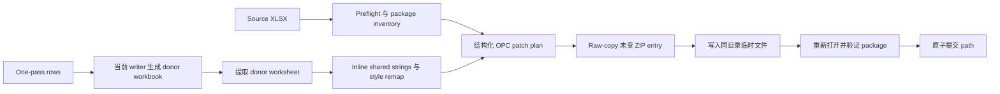

# 现有工作簿 Insert 实施计划

[English](insert-existing-workbook-plan.md)

## 状态

- 计划基线：MiniExcel-Rust `e93f851`（`0.2.0`）。
- 兼容参考：MiniExcel .NET `1.46.1`，commit `84be55a97cda12b060107577b8765043eff651b0`。
- 范围：在现有 XLSX workbook 中新增或替换 worksheet，源 row 只消费一次，并保留无关 package 内容。
- 执行规则：每次只实现一个编号 task。当前 task 的验收测试和窄验证命令通过前，不得开始下一个 task。
- 公共 API 规则：Task 6 前保持内部实现；早期 task 只允许暴露供聚焦测试使用的 crate-private seam。

## 目标

实现符合 Rust 习惯、并强化 package 保留与失败安全的 MiniExcel v1 `Insert` 等价能力：

- 目标 path 不存在时创建 workbook。
- 向现有 workbook 末尾新增 worksheet。
- 可选替换现有 worksheet。
- 返回数据 row 数，不包含 header。
- 复用当前 `WriteOptions` 的 header、format、style、pane、filter、width、visibility 和 worksheet validation。
- 通过显式 schema API 支持只遍历一次的 row producer。
- 保留无关 ZIP entry 和现有 workbook relationship identity。
- 生成、校验或提交失败时，原 path 仍保持有效。

## 参考契约

.NET v1 公共接口是 path/stream 版本的 `MiniExcel.Insert` 与 `InsertAsync`。控制实现在 `src/MiniExcel/OpenXml/ExcelOpenXmlSheetWriter*.cs`，主要聚焦测试是同步和异步 `MiniExcelOpenXmlTests.InsertSheetTest`。

| 行为 | Rust 目标契约 |
| --- | --- |
| 输出 path 不存在 | 创建单 worksheet workbook，并返回数据 row 数。 |
| 新 sheet name | 按现有 workbook sheet 顺序追加。 |
| 名称重复且禁止覆盖 | 返回明确 error，workbook 不发生变化。 |
| 名称重复且允许覆盖 | 替换目标 worksheet，并保留其顺序、ID、relationship ID、target path、visibility 和 active 状态。 |
| Row count | 不包含输出的 header。 |
| 名称匹配 | 遵循 Excel worksheet name 语义，不区分大小写；这是对 v1 大小写敏感 lookup 的有意修正。 |
| 现有 package part | 除必须结构化 patch 的 part 外，保持原始字节。 |
| 插入 sheet 中的 string | 将 donor shared string 转为 inline string，不重写现有 shared-string table。 |
| `.xlsm`、VBA、签名、加密 | 创建 replacement output 前拒绝。 |
| Path insert 中途失败 | 原 workbook 不变；这是相对 v1 原地更新的有意改进。 |

## 非目标

- 向现有 worksheet 追加 row。
- 公式计算或公式引用重写。
- 编辑 pivot、chart、table、comment、image、external link 或 VBA 内容。
- 首个版本保留被覆盖 worksheet 的依赖对象。
- 在同一个 stream 上提供 crash-safe 原地 mutation。
- CSV Insert。
- WASM filesystem insertion。
- 首个版本集成 async runtime。

## 拟议公共 API

公共 API 只在 Task 6 加入；此前必须先证明 package rewrite 与原子 path 行为。

```rust
#[derive(Clone, Copy, Debug, Default, Eq, PartialEq)]
pub enum ExistingSheetPolicy {
    #[default]
    Error,
    Replace,
}

#[derive(Clone, Copy, Debug, Default, Eq, PartialEq)]
pub enum TargetRelationshipPolicy {
    #[default]
    Reject,
    RemoveSupported,
}

#[derive(Clone, Debug)]
pub struct InsertOptions {
    // Builder 管理以下字段：
    // write_options: WriteOptions
    // existing_sheet_policy: ExistingSheetPolicy
    // target_relationship_policy: TargetRelationshipPolicy
}

impl MiniExcel {
    pub fn insert(
        path: impl AsRef<Path>,
        rows: &[DynamicRow],
        options: &InsertOptions,
    ) -> Result<usize>;

    pub fn insert_with_schema<I>(
        path: impl AsRef<Path>,
        schema: &[String],
        rows: I,
        options: &InsertOptions,
    ) -> Result<usize>
    where
        I: IntoIterator<Item = Result<DynamicRow>>;

    pub fn insert_serialized<T>(
        path: impl AsRef<Path>,
        rows: &[T],
        options: &InsertOptions,
    ) -> Result<usize>
    where
        T: Serialize;

    pub fn insert_from_reader_to_writer<R, W>(
        source: &mut R,
        destination: &mut W,
        rows: &[DynamicRow],
        options: &InsertOptions,
    ) -> Result<usize>
    where
        R: Read + Seek,
        W: Write + Seek;

    pub fn insert_with_schema_from_reader_to_writer<R, W, I>(
        source: &mut R,
        destination: &mut W,
        schema: &[String],
        rows: I,
        options: &InsertOptions,
    ) -> Result<usize>
    where
        R: Read + Seek,
        W: Write + Seek,
        I: IntoIterator<Item = Result<DynamicRow>>;

    pub fn insert_serialized_from_reader_to_writer<T, R, W>(
        source: &mut R,
        destination: &mut W,
        rows: &[T],
        options: &InsertOptions,
    ) -> Result<usize>
    where
        T: Serialize,
        R: Read + Seek,
        W: Write + Seek;
}
```

`InsertOptions` 将 sheet name、header、style、format、pane、filter、width 和 visibility 委托给 `WriteOptions`。`overwrite_file` 不适用于 Insert；replacement 由 `ExistingSheetPolicy` 控制。

## 架构



Donor-workbook 方案复用经过测试的 `XlsxWriter`，避免重复实现 serialization、style、AutoFilter、pane、width、visibility 和 Serde 行为。只移植 donor worksheet 与必要 style definition。

## Task 顺序

### Task 0：刻画 MiniExcel v1 Insert

- [x] 将 v1 同步/异步 `InsertSheetTest` 的可观察行为移植到 `miniexcel/tests/insert.rs` 的可执行 contract table。它替代 ignored placeholder，并可供后续 task 直接驱动。
- [x] 固定 missing-path 创建、append 顺序、duplicate 拒绝、replacement、header/no-header row count 和超长 sheet name validation。
- [x] 增加确定性生成的 package fixture：非连续 `sheetId`、非连续 relationship ID、hidden/very-hidden、active sheet、defined name、formula、shared string、custom style、table、drawing、comment 和 custom XML。
- [x] 增加测试 package inventory helper，记录 ZIP entry name/CRC、relationship identity、sheet order/ID/state、active tab、defined name 和 style count。
- [x] 记录 Rust 不复制的 v1 quirks：原地 mutation、sheet-ID 重编号、随机替换 relationship、relationship 丢失和大小写敏感 sheet lookup。

已于 2026-08-24 完成。聚焦测试：`cargo +1.85.0 test -p miniexcel --test insert characterization --locked`。

验收：

- 尚无公共 API 或 production package mutation。
- 每个 fixture 都有明确 package invariant。
- 聚焦命令：`cargo +1.85.0 test -p miniexcel --test insert characterization --locked`。

### Task 1：OPC Package Inventory 与 Preflight

依赖 Task 0。

- [x] 新增内部 `insert/package.rs`，为 content type、workbook sheet、workbook relationship、workbook view、defined name 和 worksheet relationship 建立 typed model。
- [x] 规范化 relationship target，不假设 `sheetN.xml`，也不从 `sheetId` 推导 path。
- [x] 保留 source workbook 中 sheet 的文档顺序。
- [x] 独立分配无冲突 `sheetId`、relationship ID 和 worksheet target。
- [x] 拒绝重复 ZIP entry name、不安全 entry path、加密/非 ZIP、macro-enabled content type、VBA relationship 和 signed OPC package。
- [x] worksheet name 不区分大小写，并复用现有 Excel name validation。
- [x] 增加 Insert 专属 error：duplicate target sheet、unsupported package feature、unsafe package、操作后无 visible sheet、atomic commit failure。

已于 2026-08-24 完成。聚焦测试：`cargo +1.85.0 test -p miniexcel insert::package::tests --lib --locked`。

验收：

- Inventory 可无写入地 roundtrip 所有 fixture metadata。
- 除小型 control part 外，不保留 workbook-sized XML。
- 聚焦命令：`cargo +1.85.0 test -p miniexcel insert::package::tests --lib --locked`。

### Task 2：Donor Worksheet 提取

依赖 Task 1。

- [x] 新增内部 donor builder，调用当前 `XlsxWriter` 生成正好一个 sheet。
- [x] 提取 donor worksheet、style、shared string 和 AutoFilter defined-name metadata。
- [x] 使用结构化 XML parser 将 donor shared-string cell 转成 inline string。
- [x] 按原样保留 donor formula，不执行计算。
- [x] 内部结果包含 worksheet XML、数据 row count、donor style model 和可选 local defined name。
- [x] 增加 dynamic、显式 schema、Serde、header-only 和 empty/no-header donor 测试。
- [x] 为未来大 producer 增加 one-pass 显式 schema row spool；成功、iterator error 或 panic unwind 时都删除 spool。

已于 2026-08-24 完成。聚焦测试：`cargo +1.85.0 test -p miniexcel insert::donor::tests --lib --locked`。

验收：

- Donor output 不依赖 donor `sharedStrings.xml`。
- Row count 和全部当前 `WriteOptions` 行为与普通 `save_as` 一致。
- 聚焦命令：`cargo +1.85.0 test -p miniexcel insert::donor::tests --lib --locked`。

### Task 3：Append-only Style Rebase

依赖 Task 2。

- [x] 解析现有与 donor `styles.xml` 中的 number format、font、fill、border、cell-style XF 和 cell XF。
- [x] 绝不改变现有 style index。
- [x] 安全时对语义相同 donor component 去重，否则 append。
- [x] 在所有现有 ID 之上分配 custom `numFmtId` 并重写 donor reference。
- [x] 构建 donor-cell-XF 到 target-cell-XF mapping，重写插入 worksheet 的全部 `s` attribute。
- [x] 输出前检查 Excel style/count limit。
- [x] 结构化 patch 时保留未知 style extension 和 unsupported node。

已于 2026-08-24 完成。聚焦测试：`cargo +1.85.0 test -p miniexcel insert::style::tests --lib --locked`。LibreOffice smoke test：设置 `MINIEXCEL_TEST_SOFFICE` 后运行 `cargo +1.85.0 test -p miniexcel insert::style::tests::rebased_styles_survive_libreoffice_roundtrip --lib --locked -- --ignored --exact`。

验收：

- 现有 cell 的 style ID 与渲染 metadata 不变。
- 插入的 date/time/duration/custom number format 可被 Rust roundtrip 和 LibreOffice 正确识别。
- 聚焦命令：`cargo +1.85.0 test -p miniexcel insert::style::tests --lib --locked`。

### Task 4：Append Package Rewrite

依赖 Task 1-3。

- [x] Raw-copy 每个未变 ZIP entry，并保留 compression 与 metadata。
- [x] 结构化 append `xl/workbook.xml` 的一个 `<sheet>`，不替换 workbook view、property、defined name、calculation setting 或 extension list。
- [x] 向 `xl/_rels/workbook.xml.rels` append 一个 worksheet relationship，不改变现有 ID 或非 sheet relationship。
- [x] 仅在缺失时向 `[Content_Types].xml` 增加 worksheet override。
- [x] 启用 AutoFilter 时增加或更新 local `_xlnm._FilterDatabase` defined name。
- [x] 将 rebased worksheet 写到无冲突 target。
- [x] 保持 `sharedStrings.xml`、未变 worksheet relationship、table、drawing、comment、external link、custom XML、theme 和 document property 原始字节不变。

已于 2026-08-24 完成。聚焦测试：`cargo +1.85.0 test -p miniexcel insert::rewrite::tests --lib --locked`。

验收：

- 新 sheet 按 workbook 顺序 append，不改变 active sheet。
- Package inventory 只在预期 control part、style addition 和新 worksheet 上有变化。
- 现有 formula 与 cached value 不变。
- 聚焦命令：`cargo +1.85.0 test -p miniexcel insert::rewrite::tests --lib --locked`。

### Task 5：Atomic Path Commit

依赖 Task 4。

- [x] Path insert 写入同目录、使用 `create_new` 打开的唯一临时文件。
- [x] 完成 ZIP central directory、flush、sync 临时文件，并重新打开做结构验证。
- [x] 验证 workbook/rels/content-types 一致性、ID/target 唯一、worksheet 可访问，且至少一个 visible worksheet。
- [x] 使用安全的跨平台 replacement primitive。Workspace code 必须保持无 `unsafe`；先评估现有 `tempfile` API，只在必要时增加范围很窄的 dependency。
- [x] 可行时保留 source permission。
- [x] 所有 error path 清理临时 package 和 row spool。
- [x] 在 preflight、row generation、ZIP copy、ZIP finish、validation 和 commit 阶段加入 failure injection。

已于 2026-08-24 完成。聚焦测试：`cargo +1.85.0 test -p miniexcel insert::atomic::tests --lib --locked`。Windows replacement 使用安全的 `atomicwrites` wrapper 以保留 staged attribute；Unix mode-bit 覆盖在 CI 的 `cfg(unix)` 下执行。

验收：

- 每个 commit 前注入失败都保持原 workbook hash 不变。
- Linux 与 Windows CI 上成功 replacement。
- 聚焦命令：`cargo +1.85.0 test -p miniexcel insert::atomic::tests --lib --locked`。

### Task 6：公共 Append API

依赖 Task 0-5。

- [x] 增加 `InsertOptions`、`ExistingSheetPolicy` 和 `TargetRelationshipPolicy` 及其文档/builder。
- [x] 增加 dynamic slice、显式 schema iterator 和 Serde insert API。
- [x] Path 不存在时委托给 new-workbook writer，并保持 row-count 语义。
- [x] 只开放 append；在 Task 7 前，`ExistingSheetPolicy::Replace` 返回明确 not-yet-supported error。
- [x] 创建任何输出前验证全部 option。
- [x] 更新 example 与双语 README。

已于 2026-08-24 完成。聚焦测试：`cargo +1.85.0 test -p miniexcel --test insert public_append --locked`。

验收：

- 公共 append 行为稳定、有文档、具备原子性；显式 schema iterator 有界内存。
- `cargo doc` 不暴露内部 package model。
- 聚焦命令：`cargo +1.85.0 test -p miniexcel --test insert public_append --locked`。

### Task 7：严格 Worksheet Replacement

依赖 Task 6。

- [x] 保留目标 sheet element 的顺序、`sheetId`、relationship ID、target path、visibility 与 active 状态。
- [x] replacement 前检查目标 worksheet relationship closure。
- [x] 默认 `TargetRelationshipPolicy::Reject` 拒绝 table、drawing、comment、hyperlink、pivot、external link 和未知 relationship type。
- [x] `RemoveSupported` 只删除明确支持的 target-owned part 与 content-type entry，绝不删除 shared/global part。
- [x] 只替换目标 worksheet XML 与其 local AutoFilter defined name。
- [x] 拒绝大小写不敏感时产生的 duplicate ambiguity。

已于 2026-08-24 完成。聚焦测试：`cargo +1.85.0 test -p miniexcel --test insert replace_sheet --locked`。

验收：

- Plain target sheet 可原位 replacement。
- Complex target sheet 在 strict mode 下失败且原文件不变。
- 所有非目标 worksheet 与 relationship 保持原始字节。
- 聚焦命令：`cargo +1.85.0 test -p miniexcel --test insert replace_sheet --locked`。

### Task 8：Calculation 与 Defined-name Policy

依赖 Task 7。

- [x] Append formula-free donor 时原样保留 `calcChain.xml`、relationship 和 calculation property。
- [x] Overwrite 时安全删除 stale calc-chain entry，或删除完整 chain part、relationship 和 content-type override。
- [x] Replacement 后设置 workbook calculation property，要求下次打开执行 full recalculation。
- [x] 保留 workbook-scope 与无关 sheet-scope defined name。
- [x] 只更新或删除目标 sheet 的 AutoFilter local defined name。
- [x] 增加 cross-sheet formula fixture，并断言 formula text 不重写、不计算。

已于 2026-08-25 完成。聚焦测试：`cargo +1.85.0 test -p miniexcel --test insert calculation_policy --locked`。

验收：

- 不留下 stale calc-chain relationship。
- 未变 formula text 与 defined name 保留。
- 聚焦命令：`cargo +1.85.0 test -p miniexcel --test insert calculation_policy --locked`。

### Task 9：完整 WriteOptions Matrix

依赖 Task 6-8。

- [x] 插入 sheet 覆盖全部当前 write option：header、AutoFilter、pane、RTL、AutoWidth、固定/隐藏列、body wrap/alignment、header style、`TableStyle`、number format、sheet visibility 和大小写不敏感 name。
- [x] 增加 dynamic、显式 schema、Serde、empty、header-only 和连续多次 insert。
- [x] 验证 donor style rebase 在重复 insert 后不改变现有 style ID。
- [x] 增加 100 次 insert 的 ID/path collision 与 package growth stress test。

验收：

- 每个已支持 new-workbook option 都有 Insert test。
- 重复 insert 后仍可被 Rust、LibreOffice 和 .NET Open XML SDK 读取。
- 聚焦命令：`cargo +1.85.0 test -p miniexcel --test insert write_options_matrix --locked`。

已于 2026-08-25 完成。聚焦矩阵覆盖 dynamic row、显式 schema iterator、Serde row、
empty/header-only sheet、append visibility、style 稳定性，以及 100 次 insert 的
collision/growth 压力测试。生成的 101-sheet 压力工作簿已由 Rust CLI 读取，经
LibreOffice 26.2.1.2 roundtrip，并在 roundtrip 前后均通过 .NET Open XML SDK 3.5.1
的 Office 2019 schema 验证，错误数为零。

### Task 10：分离 Reader/Writer Insert API

依赖 Task 9。

- [x] 为独立 borrowed input/output 实现 `insert_from_reader_to_writer`。
- [x] Input 要求 `Read + Seek`，output 要求 `Write + Seek`；两者保持 open。
- [x] 不 truncate destination；文档要求调用方提供空 sink。
- [x] source、row iterator 和 destination error 原样传播，且不额外消费 row。
- [x] 继续不支持 same-stream mutation，因为它无法提供相同 atomicity 契约。

验收：

- 成功和失败后 input 不变、两端仍可使用。
- Output package inventory 与 path API 一致。
- 聚焦命令：`cargo +1.85.0 test -p miniexcel --test insert borrowed_io --locked`。

已于 2026-08-25 完成。Dynamic、显式 schema iterator 与 Serde reader-to-writer API
共用 package preflight 及 append/replace 行为。测试比较 append/replacement output 与 path
API inventory，证明 source/policy failure 不消费 row、producer error 后立即停止、非空 sink
保持原样，并在 destination failure 传播后仍保持两个 borrowed object 可继续使用。

### Task 11：Security、Resource 与 Stress Hardening

依赖 Task 10。

- [x] 为 control XML 和 entry count 增加 ZIP-bomb limit。
- [x] 拒绝 path traversal、重复 normalized target、relationship cycle、超大 XML attribute 和 unsupported strict-namespace package，并给出明确 error。
- [x] 检测 path rewrite 期间 source 变化，并在 commit 前 abort。
- [x] 用显式 schema iterator 测量一百万 inserted rows 的 peak working set。
- [x] 验证 RAM 不随 row count 增长，除当前 row、schema、style map、ZIP directory 和 bounded buffer 外。
- [x] 对同一路径并发 insert，保证一次成功或确定性 conflict，且文件不损坏。

验收：

- Security fixture 在 commit 前失败。
- Stress test 满足文档化 disk/RAM 边界。
- 聚焦命令：`cargo +1.85.0 test -p miniexcel --test insert hardening --locked`。

已于 2026-08-25 完成。Preflight 限制为 65,535 个 package entry、单个 control part
16 MiB、累计 control XML 64 MiB、XML attribute 64 KiB、depth 256，以及 262,144 个
relationship。Path Insert 使用 advisory lock，并在 commit 前校验 SHA-256 source
fingerprint。Release-mode 一百万行测试耗时 282.91 秒，peak working set 为 7.13 MiB，
peak temporary storage 为 258.98 MiB，XLSX output 为 9.58 MiB；10,000 行 baseline 为
6.65 MiB，证明 worksheet memory 不随 row count 增长。LibreOffice 26.2.1.2 已成功
roundtrip 流式 style-rebase output。

### Task 12：可选 Async Producer Feature

依赖 Task 11；此 task 可选，并应使用 feature flag。

- [x] 定义 async producer API，不让 Tokio 成为 core mandatory dependency。
- [x] 通过 bounded channel 将数据交给 blocking package worker。
- [x] 支持 preflight 前、row generation、ZIP copy 与 commit 前 cancellation。
- [x] 每个 cancellation point 都保证 cleanup 和原文件保留。
- [x] 如果 ZIP backend 仍是 blocking，不得把 async scheduling 描述为 async ZIP I/O。

验收：

- Cancellation test 覆盖全部生命周期阶段。
- 默认 feature build 保持 runtime-neutral。

已于 2026-08-25 在可选 `async` feature 后完成。Public 显式 schema async producer 使用
capacity-16 channel、runtime-neutral `CancellationToken` 和一个 blocking XLSX worker
thread。确定性 phase-hook test 覆盖 preflight 前、row polling 前、row generation、ZIP
copy、validation、commit 前 cancellation，以及 future-drop cleanup 与 producer-error
over-poll 防护。默认与 wasm32 build 仍保持 runtime-neutral。

### Task 13：文档、兼容契约与 Release

依赖以上全部必需 task。

- [x] 更新 `README.md` 与 `docs/i18n/README.zh-CN.md`，增加 append/replace example 和 atomicity guarantee。
- [x] 更新双语 compatibility 文档，只移除实际完成的 Insert 缺口。
- [x] 更新双语 feature-gap 报告，保留 overwrite/async 等剩余限制。
- [x] Insert 行为保留在聚焦 Rust test 中，不扩展共享 query parity contract。
- [x] 通过现有 Rust validation path 运行 append、replace、failure injection 与 async cancellation。
- [x] 发布 migration note，说明与 v1 的有意差异。

验收：

- 文档不暗示 row append、macro edit、formula calculation 或不安全 same-stream atomicity。
- 干净 checkout 上 release check 全部通过。

已于 2026-08-25 完成。聚焦 Rust test 覆盖 Insert create、append、replacement、duplicate
rejection、atomic failure injection、async cancellation、relationship cleanup 与外部应用
验证。双语 v1 migration note 记录有意保留的语义与 atomicity 差异，不扩展共享 query
parity 基础设施。

## 验证阶梯

每次 substantive edit 后立即运行当前 task 的最窄测试。每个 task 标记完成前运行：

```powershell
cargo +1.85.0 fmt --all -- --check
cargo +1.85.0 clippy -p miniexcel --all-targets --locked -- -D warnings
cargo +1.85.0 test -p miniexcel --test insert --locked
```

公开或发布 API 前运行：

```powershell
cargo +1.85.0 clippy --workspace --all-targets --locked -- -D warnings
cargo +1.85.0 test --workspace --all-targets --locked
$env:RUSTDOCFLAGS='-D warnings'; cargo +1.85.0 doc --workspace --no-deps --locked
cargo +1.85.0 package --manifest-path miniexcel/Cargo.toml --locked
```

生成 package 的外部验证：

- 使用 LibreOffice headless 打开并保存，再由 Rust reader 重新打开。
- 使用 .NET Open XML SDK 打开并执行 package validation。
- 在共享 fixture 上运行 MiniExcel v1 的聚焦 `InsertSheetTest`。

## 完成定义

只有满足以下全部条件，现有工作簿 Insert 才算完成：

- Append 与 strict replace API 已公开并有文档。
- Missing path 可创建新 workbook。
- 显式 schema insert 只消费 row 一次，RAM 有界。
- 未变 package part 与 relationship identity 保留。
- Replacement 不会静默遗留 target relationship 或 calculation metadata。
- Path 写入在支持平台上经过验证并原子提交。
- Failure/cancellation 不会损坏原 workbook。
- Dynamic、Serde、path 和独立 reader/writer workflow 均有测试。
- 双语文档明确全部支持边界与 v1 有意差异。